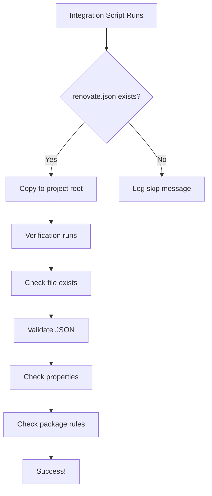

# Renovate Feature Testing Documentation

## Overview

This document describes the comprehensive test coverage for the Renovate feature in PHP Booster. The Renovate feature provides automated dependency management by copying a pre-configured `renovate.json` file to integrated projects.

## Test Coverage

### 1. JavaScript/TypeScript Unit Tests (12 tests)
**Location**: `booster/tools/git-hooks/tests/renovate.test.mjs`

These tests validate the structure and content of the `renovate.json` configuration file:

- ✅ File existence validation
- ✅ Valid JSON structure
- ✅ Schema URL presence (`$schema`)
- ✅ Base configuration extension (`extends: ["config:base"]`)
- ✅ Package rules definition
- ✅ Automerge configuration for patch/minor updates
- ✅ Dev dependencies grouping rule
- ✅ PHP dependencies grouping rule (phpunit, phpstan, psalm, symfony, doctrine, guzzlehttp)
- ✅ Schedule configuration (weekend updates)
- ✅ Label configuration (dependencies, renovate)
- ✅ Branch prefix configuration (`deps/`)
- ✅ Timezone configuration

**Run with**:
```bash
cd booster
pnpm vitest run tools/git-hooks/tests/renovate.test.mjs
```

### 2. Python Unit Tests (3 tests)
**Location**: `tools/internal-test/test_renovate_verification.py`

These tests validate the verification logic for the renovate.json file:

- ✅ Valid renovate.json validation passes
- ✅ Missing schema property is detected with warning
- ✅ Invalid JSON is properly rejected

**Run with**:
```bash
cd tools/internal-test
python3 test_renovate_verification.py
```

### 3. Integration Test Enhancement
**Location**: `tools/internal-test/lib/verification.py`

The integration verification now includes:

- ✅ Checks that `renovate.json` exists after integration
- ✅ Validates JSON structure
- ✅ Verifies essential properties ($schema, extends, packageRules)
- ✅ Validates automerge rule exists
- ✅ Validates dev dependencies grouping
- ✅ Validates PHP dependencies grouping

This verification runs as part of the full integration test suite.

### 4. Test Runner Script
**Location**: `tools/test-renovate-feature.sh`

A convenience script that runs all renovate-related tests:

```bash
./tools/test-renovate-feature.sh
```

This script:
1. Runs the 12 JavaScript tests
2. Runs the 3 Python verification tests
3. Provides a clear summary of results

## CI/CD Integration

### GitHub Actions Workflow
**Location**: `.github/workflows/unit-tests.yml`

A new workflow runs on every push and pull request to:
- Run JavaScript/TypeScript unit tests
- Run Python unit tests
- Execute the complete test suite

This provides fast feedback without requiring DDEV or Docker.

## Test Results

All tests pass successfully:
- **JavaScript tests**: 12/12 passed
- **Python tests**: 3/3 passed
- **Total**: 15/15 tests passed

## Integration Flow



## Key Files

| File | Purpose |
|------|---------|
| `booster/renovate.json` | Source configuration file |
| `booster/integrate_booster.sh` (lines 607-614) | Integration logic |
| `booster/tools/git-hooks/tests/renovate.test.mjs` | JavaScript unit tests |
| `tools/internal-test/test_renovate_verification.py` | Python unit tests |
| `tools/internal-test/lib/verification.py` | Integration verification |
| `tools/test-renovate-feature.sh` | Test runner |

## Testing Philosophy

The tests follow the principle of minimal changes:
1. **No modification** of existing test infrastructure
2. **Additive approach** - only add to expected files list
3. **Comprehensive coverage** - validate all aspects of the feature
4. **Easy to run** - simple commands with no complex setup
5. **CI-friendly** - runs without DDEV for fast feedback

## Maintenance

When updating the renovate.json configuration:

1. Update `booster/renovate.json` with new rules
2. Update test assertions in `renovate.test.mjs` to match
3. Update verification logic in `verification.py` if needed
4. Run the test suite to validate: `./tools/test-renovate-feature.sh`
5. Verify CI passes before merging

## Future Enhancements

Potential improvements to consider:
- Schema validation against Renovate's JSON schema
- Integration test that verifies renovate.json works in a real project
- Test for handling corrupted or malformed renovate.json
- Test for different project types (non-PHP projects)
