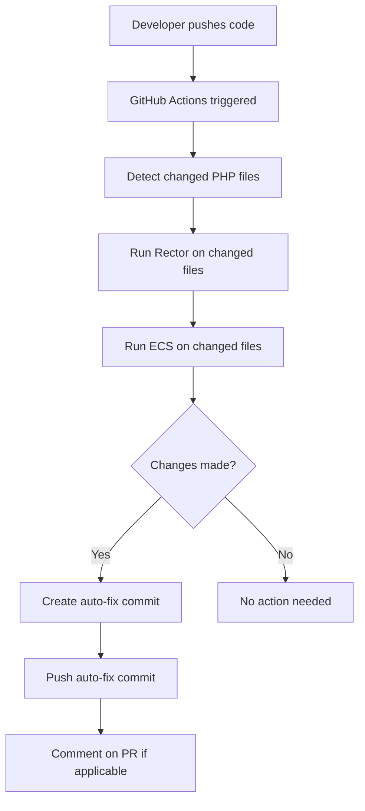

# GitHub Actions Auto-Fix

The PHP Booster includes powerful GitHub Actions that automatically apply code style fixes and modernizations to your PHP codebase. This feature moves the code quality enforcement from local development machines to the cloud, ensuring consistent code standards across your entire team.

## Overview

The auto-fix GitHub Actions automatically run on every push and pull request, processing changed PHP files with:

- **Rector** - Automatic refactoring and PHP modernization
- **ECS** - Code style standardization and formatting
- **Smart detection** - Only processes files that were actually changed
- **Auto-commits** - Creates descriptive commits with applied fixes

## How It Works



## Features

### 🤖 Automatic Processing
- Triggers on pushes to main branches and pull requests
- Processes only files that were changed in the commit/PR
- Respects existing Rector and ECS configuration

### 🔧 Smart Configuration
- Uses your project's `rector.php` and `ecs.php` configuration files
- Configurable PHP versions and tool settings
- Skip patterns to prevent infinite loops

### 📝 Transparent Operations
- Creates clear, descriptive commit messages
- Comments on pull requests when fixes are applied
- Includes `[skip ci]` to prevent triggering other workflows

### ⚡ Performance Optimized
- Composer dependency caching
- Only runs on PHP file changes
- Efficient file detection based on git diffs

## Available Workflows

The booster provides two GitHub Action workflows:

### Complete Workflow (`php-auto-fix.yml`)
Full-featured workflow with comprehensive error handling and logging:

```yaml
name: PHP Auto-Fix (Rector & ECS)
on:
  push:
    branches: [ main, master, develop, 'feature/**' ]
    paths: [ '**.php' ]
  pull_request:
    branches: [ main, master, develop ]
    paths: [ '**.php' ]
```

### Simple Workflow (`php-auto-fix-simple.yml`)
Streamlined version using the reusable action component:

```yaml
- name: Run PHP Auto-Fix
  uses: ./.github/actions/php-auto-fix
  with:
    php-version: '8.3'
```

## Configuration

### Environment Variables

Customize the behavior using these inputs:

| Input | Description | Default |
|-------|-------------|---------|
| `php-version` | PHP version to use | `8.3` |
| `skip-rector` | Skip Rector processing | `false` |
| `skip-ecs` | Skip ECS processing | `false` |
| `commit-message` | Custom commit message | `style: auto-fix code with Rector and ECS` |
| `file-pattern` | File pattern to match | `*.php` |

### Skip Auto-Fix

To skip auto-fix for specific commits, include `[skip auto-fix]` in your commit message:

```bash
git commit -m "feat: add new feature [skip auto-fix]"
```

### Custom Configuration

Example of a customized workflow:

```yaml
- name: Run PHP Auto-Fix
  uses: ./.github/actions/php-auto-fix
  with:
    php-version: '8.2'
    skip-rector: 'false'
    commit-message: 'chore: apply automatic code fixes'
```

## Security Considerations

- Uses `GITHUB_TOKEN` with minimal required permissions
- Only processes files changed in the current commit/PR
- Validates tool availability before execution
- Includes safeguards against infinite loops

## Benefits

### For Developers
- 🚀 **Faster local development** - No need to run formatters locally
- 🔄 **Consistent code style** across the entire team
- 📈 **Automatic modernization** of legacy PHP patterns
- 🛡️ **Reduced merge conflicts** from formatting differences

### For Teams
- 📊 **Enforced standards** without developer overhead
- 🤝 **Improved code reviews** - Focus on logic, not style
- 🔧 **Automatic maintenance** of code quality
- 📝 **Transparent process** with clear commit history

## Integration with Git Hooks

The GitHub Actions work seamlessly with local git hooks:

- **Local hooks** catch issues during development
- **GitHub Actions** provide a safety net for anything that slips through
- **Consistent tooling** ensures the same rules apply everywhere

This creates a comprehensive code quality pipeline from development to production.

## Troubleshooting

### Action Not Running
- Verify PHP files were actually changed
- Check workflow triggers match your branch names
- Ensure `rector.php` and `ecs.php` exist

### No Changes Applied
- Confirm Rector and ECS are installed via Composer
- Validate configuration files are correct
- Check action logs for specific error messages

### Permission Issues
- Ensure repository has Actions enabled
- Verify `GITHUB_TOKEN` has write permissions
- For protected branches, consider using a personal access token

## Examples

### Basic Auto-Fix Commit
```
style: auto-fix code with Rector and ECS

Files processed: src/Controller/UserController.php src/Service/EmailService.php

This commit was automatically created by GitHub Actions
to apply code style fixes and modernizations.

[skip ci]
```

### PR Comment
When fixes are applied to a pull request, the action automatically adds a comment:

> 🤖 **Auto-fix Applied**
> 
> Rector and ECS have automatically fixed code style and modernization issues.
> 
> Files processed: `src/Controller/UserController.php`
> 
> Please review the changes before merging.

The GitHub Actions auto-fix feature ensures your codebase maintains consistent quality standards without any manual intervention, making code reviews more focused and productive.