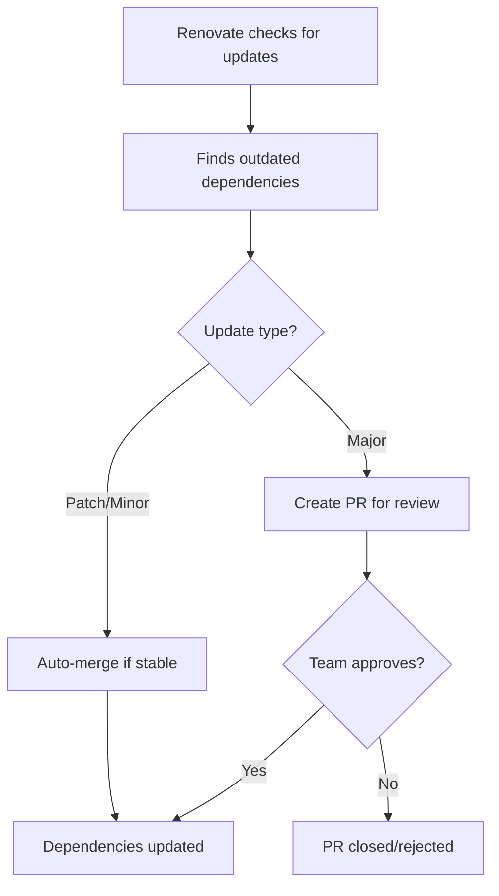

# Renovate Bot Integration

The PHP Booster includes a pre-configured [Renovate](https://docs.renovatebot.com/) setup for automated dependency management. Renovate keeps your PHP and JavaScript dependencies up-to-date automatically, reducing security vulnerabilities and maintenance overhead.

## Overview

Renovate is a dependency update tool that automatically creates pull requests to update your project dependencies. The booster provides a sensible default configuration optimized for PHP projects.

## How It Works



## Features

### 🤖 Automated Updates
- Automatically detects outdated dependencies
- Creates pull requests with changelogs and release notes
- Schedules updates to avoid disruption (weekends by default)

### 🔧 Smart Grouping
- Groups related dependencies together
- Separates dev dependencies from production
- Groups PHP-specific packages for easier review

### ⚡ Intelligent Merging
- Auto-merges stable patch and minor updates
- Requires manual review for major version updates
- Never auto-merges pre-release versions (0.x.x)

### 📝 Clear Communication
- Labels PRs with `dependencies` and `renovate`
- Uses `deps/` branch prefix for organization
- Provides detailed information about each update

## Configuration

The default `renovate.json` configuration includes:

```json
{
  "$schema": "https://docs.renovatebot.com/renovate-schema.json",
  "extends": [
    "config:base"
  ],
  "packageRules": [
    {
      "matchUpdateTypes": ["minor", "patch"],
      "matchCurrentVersion": "!/^0/",
      "automerge": true
    },
    {
      "matchDepTypes": ["devDependencies"],
      "groupName": "dev dependencies",
      "schedule": ["every weekend"]
    },
    {
      "matchPackagePatterns": ["^php/", "phpunit/", "phpstan/", "psalm/", "symfony/"],
      "groupName": "PHP dependencies"
    }
  ],
  "timezone": "Europe/Paris",
  "schedule": ["every weekend"],
  "labels": ["dependencies", "renovate"],
  "branchPrefix": "deps/"
}
```

### Key Settings

| Setting | Description | Default Value |
|---------|-------------|---------------|
| `extends` | Base configuration preset | `config:base` |
| `schedule` | When to check for updates | `every weekend` |
| `timezone` | Timezone for scheduling | `Europe/Paris` |
| `labels` | PR labels | `dependencies`, `renovate` |
| `branchPrefix` | Branch naming prefix | `deps/` |
| `automerge` | Auto-merge stable updates | Enabled for patch/minor |

### Customization

You can customize the configuration after integration by editing `renovate.json` in your project root:

#### Change Update Schedule
```json
{
  "schedule": ["every weekday"]
}
```

#### Adjust Automerge Rules
```json
{
  "packageRules": [
    {
      "matchUpdateTypes": ["patch"],
      "automerge": true
    }
  ]
}
```

#### Customize Grouping
```json
{
  "packageRules": [
    {
      "matchPackagePatterns": ["symfony"],
      "groupName": "Symfony packages"
    }
  ]
}
```

## Enabling Renovate

### On GitHub

1. Install the [Renovate GitHub App](https://github.com/apps/renovate) on your repository
2. Grant necessary permissions (read repo contents, create PRs)
3. Renovate will automatically detect your `renovate.json` configuration
4. Wait for the first pull request with dependency updates

### On GitLab

1. Go to your project's **Settings > Members**
2. Add the Renovate bot user with at least **Developer** role (required for creating merge requests)
3. Configure CI/CD variables if needed:
   - `RENOVATE_TOKEN`: Personal access token with API access (for private repos)
   - `RENOVATE_PLATFORM`: Set to `gitlab`
4. Optional: Set up scheduled pipelines to run Renovate at regular intervals
5. Renovate will start creating merge requests based on your `renovate.json` configuration

For more details, see [Renovate GitLab documentation](https://docs.renovatebot.com/modules/platform/gitlab/).

### Self-Hosted

For self-hosted Renovate installations:

1. Install Renovate following the [self-hosting guide](https://docs.renovatebot.com/self-hosting/)
2. Configure your Renovate instance to scan repositories with `renovate.json` files
3. Set up environment variables:
   - `RENOVATE_PLATFORM`: Your git platform (`github`, `gitlab`, `bitbucket`, etc.)
   - `RENOVATE_ENDPOINT`: Your platform's API endpoint
   - `RENOVATE_TOKEN`: Authentication token with repository access
4. The provided `renovate.json` configuration works with self-hosted instances
5. Consider customizing the schedule to match your team's workflow

**Example Docker command:**
```bash
docker run --rm \
  -e RENOVATE_PLATFORM=gitlab \
  -e RENOVATE_ENDPOINT=https://gitlab.example.com/api/v4 \
  -e RENOVATE_TOKEN=your-token \
  -v /path/to/config:/usr/src/app/config \
  renovate/renovate
```

For more advanced setups, refer to the [official self-hosting documentation](https://docs.renovatebot.com/self-hosting/).

## Package Support

Renovate automatically detects and updates:

- **PHP** - Composer dependencies (`composer.json`)
- **JavaScript** - npm/pnpm/yarn packages (`package.json`)
- **Docker** - Base images in Dockerfiles
- **GitHub Actions** - Action versions in workflows

## Best Practices

### Review Strategy
- ✅ Auto-merge patch updates (bug fixes)
- ✅ Auto-merge minor updates (new features, backward compatible)
- ⚠️ Manually review major updates (breaking changes)
- ⚠️ Always review updates for security-critical packages

### Repository Settings
- Enable **branch protection** rules on your main branch
- Require **status checks** to pass before merging
- Consider requiring **code owner reviews** for major updates

### Testing
- Ensure your **CI/CD pipeline** runs on Renovate PRs
- Include **integration tests** to catch breaking changes
- Use **semantic versioning** in your own packages

## Benefits

### For Developers
- 🔒 **Improved security** through timely dependency updates
- 📈 **Stay current** with latest package features
- 🕐 **Time savings** from automated update management
- 📊 **Clear visibility** of dependency health

### For Teams
- 🛡️ **Reduced vulnerabilities** through faster patching
- 🔄 **Consistent updates** across all projects
- 📝 **Audit trail** with automated PR history
- 🎯 **Focused reviews** on meaningful changes

## Troubleshooting

### Renovate Not Creating PRs
- Verify the Renovate app is installed and has access
- Check that `renovate.json` is valid JSON
- Review Renovate logs in your repository settings
- Ensure dependencies are not pinned or locked

### Too Many PRs
- Adjust the schedule to less frequent checks
- Enable more aggressive grouping rules
- Increase the automerge criteria

### Failing Status Checks
- Review your CI/CD pipeline configuration
- Check if tests need updates for new package versions
- Consider updating test fixtures or mocks

### Merge Conflicts
- Keep your base branch up to date
- Rebase Renovate branches regularly
- Enable Renovate's rebase options

## Integration with Other Tools

Renovate works seamlessly with:

- **GitHub Actions** - Automatically triggers CI checks
- **Composer Audit** - Security vulnerability scanning
- **PHPStan/Psalm** - Static analysis on updated code
- **Git Hooks** - Pre-commit validation still applies

## Advanced Configuration

### Extending Presets
```json
{
  "extends": [
    "config:base",
    ":dependencyDashboard",
    ":semanticCommits",
    ":automergeDigest"
  ]
}
```

### Custom Managers
```json
{
  "regexManagers": [
    {
      "fileMatch": ["^Dockerfile$"],
      "matchStrings": ["ENV PHP_VERSION=(?<currentValue>.*?)\\n"],
      "datasourceTemplate": "github-releases",
      "depNameTemplate": "php/php-src"
    }
  ]
}
```

### Notifications
```json
{
  "vulnerabilityAlerts": {
    "enabled": true,
    "labels": ["security"]
  }
}
```

## Resources

- [Renovate Documentation](https://docs.renovatebot.com/)
- [Configuration Options](https://docs.renovatebot.com/configuration-options/)
- [Preset Configs](https://docs.renovatebot.com/presets-default/)
- [GitHub App](https://github.com/apps/renovate)

The Renovate integration ensures your dependencies stay current, secure, and well-maintained with minimal manual effort.
